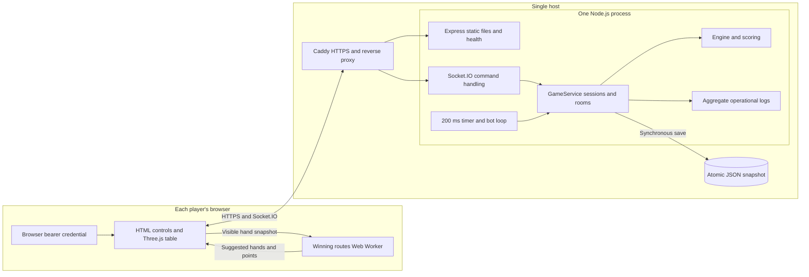
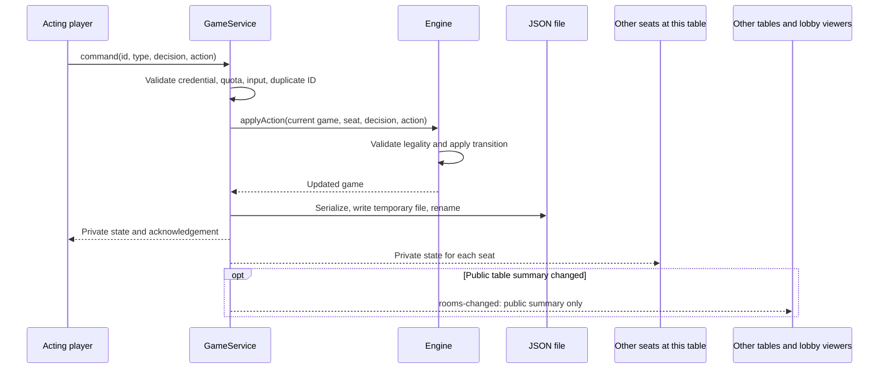
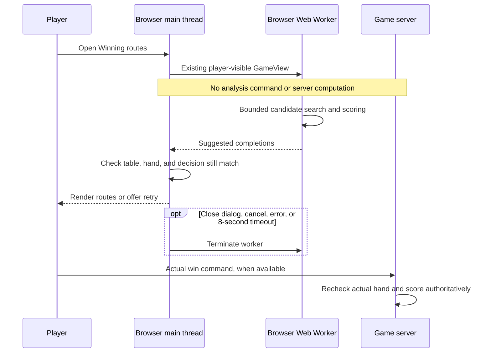
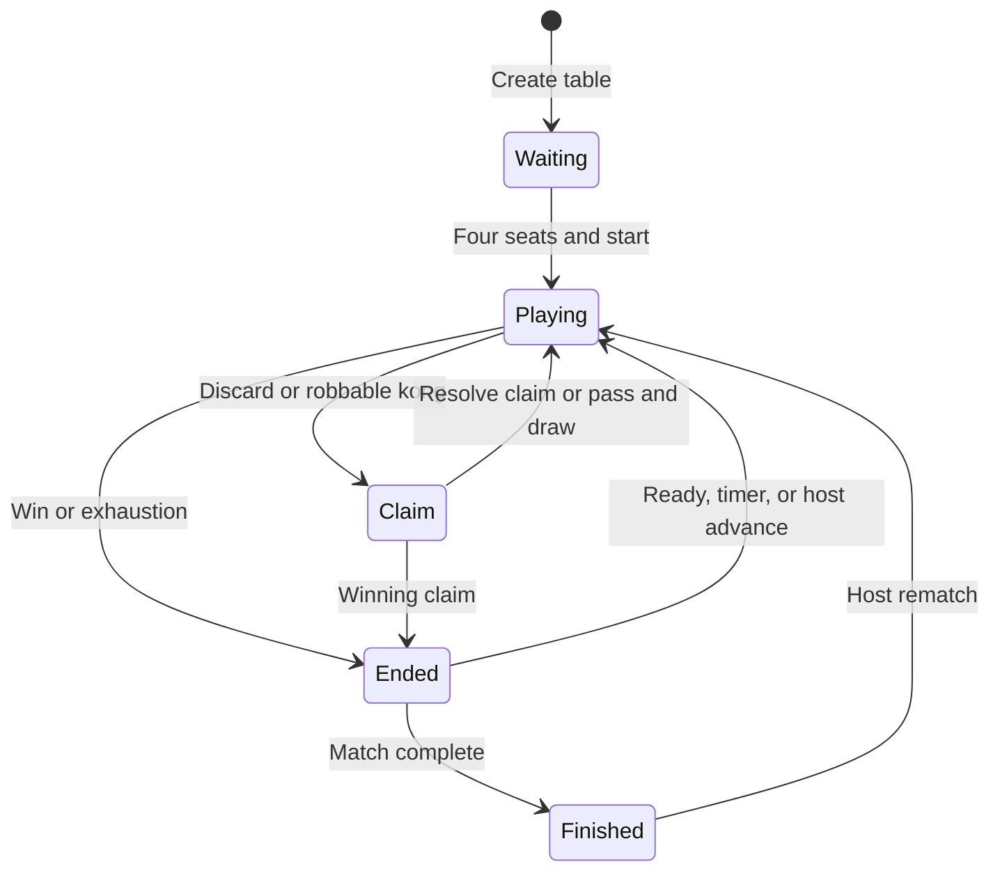
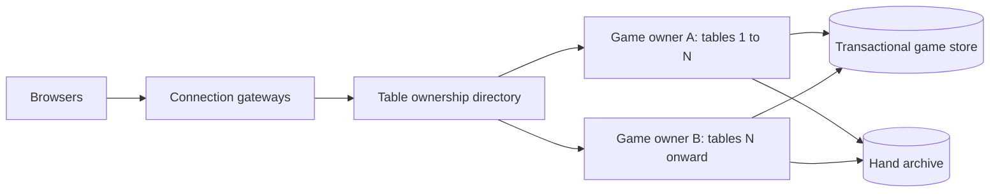

# Four Winds architecture

Updated 27 September 2026. This describes the implementation in this branch. See the
[capacity audit](capacity-audit.md) for measurements, limits, and the work still needed for
sustained operation at 100 games / 400 players.

## System overview

One Node.js process owns all tables. Browsers render their own views and submit commands;
the server decides legality, claim priority, timeouts, scoring, and settlement.

Three.js, backgrounds, sound, tooltips, animations, and camera rotation run in the browser.
The server never renders the board. `gameView()` constructs a separate view for each seat,
removing wall order, seed, ura indicators, other concealed hands, and private claim details.
Completed hands intentionally reveal the result hands. The client still keeps opponents'
physical table meshes face down.

The production Compose file runs one game container and one Caddy container. Only Caddy
publishes network ports. The game container has a 768 MiB memory limit and a persistent data
volume. Current backups copy `four-winds.json`; this matters before changing the storage format.

## Code boundaries

| Module                                          | Responsibility                                                                 |
| ----------------------------------------------- | ------------------------------------------------------------------------------ |
| `client/main.ts`                                | Screens, dialogs, socket state, turn controls                                  |
| `client/table.ts`, `hand-rack.ts`               | Cosmetic table and interactive tile rack                                       |
| `client/hand-analysis.ts`, `analysis-worker.ts` | Cancellable local route analysis                                               |
| `shared/analysis-view.ts`                       | Convert a public seat view to an ordinary self-draw analysis scenario          |
| `shared/types.ts`, `rules.ts`, `tiles.ts`       | Protocol, domain types, presets, validation, tile identities                   |
| `server/service.ts`                             | Authentication, sessions, lobbies, tables, delivery, storage, bot scheduling   |
| `server/engine.ts`                              | Authoritative state transitions and legal actions                              |
| `server/scoring.ts`, `shapes.ts`                | Pure scoring/shape logic, also bundled into the analysis worker                |
| `server/hand-analysis.ts`                       | Bounded suggestion search; invoked by the browser worker, not network commands |
| `server/lessons.ts`                             | Isolated ruleset-specific learning examples checked through the engine         |
| `server/security.ts`                            | Origin validation and connection rate limits                                   |
| `server/metrics.ts`                             | Event-loop and memory measurements in server logs                              |
| `tests/load/`                                   | Separate-process socket load generator with isolated storage                   |

The scorer modules live under `server/` for historical reasons but contain no networking,
credentials, or filesystem access. The worker imports those pure modules, so suggestions and
actual wins use the same patched MCR/Riichi libraries and Singapore implementation.

## Command and update flow

Socket callbacks and the timer run serially on the same event loop. This preserves receipt
ordering for equal-priority claims, but CPU work or synchronous disk work delays **all** tables.
Putting a function behind a Promise would not by itself move its CPU work off that loop.

Normal actions, ready/advance commands, starts, rematches, and timer/bot changes refresh only
the affected tables. Public summary changes are small `rooms-changed` events scoped to the
containing lobby. Membership, profile, rules, and chat changes still use full broadcasts; the
[audit](capacity-audit.md) identifies this remaining cost. Rejected commands refresh only the
caller when useful. Read-only errors do not trigger state broadcasts.

Command IDs are cached for connected profiles (up to 200 replies); engine decision IDs reject
stale actions independently. Disconnecting the last socket releases the profile's transient
reply/chat caches. A reconnect gets a fresh authoritative snapshot and retains its stored seat.

## Winning routes

Each browser has at most one active calculation. The worker is created on demand and terminated
on completion or cancellation; its separate asset is about 112 kB before compression in the
measured build. It cannot send gameplay commands. Slow or unsupported analysis shows a retry
option and leaves the game controls usable. Results for an old table/hand/decision are discarded.
Old clients calling `analyze-hand` receive a cheap request to refresh the page.

Suggestions assume an ordinary self-draw and use current melds, bonuses, and public dora.
They exclude secret indicators, first-turn/last-tile/replacement bonuses, and future riichi.
The search is bounded and does not promise available draws or authorize a win. Route beam
ranking precomputes costs and sort keys rather than recalculating them inside sort comparisons.

Web Workers execute separately from the page's main thread and exchange cloned messages.
See [MDN's worker guide](https://developer.mozilla.org/en-US/docs/Web/API/Web_Workers_API/Using_web_workers).

## Game lifecycle

The engine is ruleset-specific. MCR, EMA Riichi, and Four Winds Singapore retain their existing
legality and scoring. Configured claim priority wins first; valid server receipt order breaks
ties. The service checks all rooms every 200 ms and pauses rooms with no connected human.
Bots use legal actions and their own hand/public information. Cosmetic animations never
advance the authoritative engine.

## Persistence, identity, and trust

- A random browser bearer credential identifies a guest profile. Only its hash is saved on the
  server. Profiles, rulesets, seat references, and hand histories live in the JSON store.
- The file contains secrets and concealed game state. It is written with mode `0600`; it must
  never be served as a static asset or committed to Git.
- Saves write a temporary file and rename it over the snapshot. This avoids partially replaced
  JSON; it is **not** a transactional database or an fsync guarantee against host power loss.
- A successful action is saved once before acknowledgement. Timer transitions are saved as a
  batch. Shutdown saves once and avoids a disconnect-triggered save/broadcast storm.
- Full completed-hand histories are capped at 100 per profile, but are still embedded in every
  snapshot and held in memory. This is the main remaining capacity blocker.
- On load, human seats are marked disconnected. A returning credential restores the seat.
  Saved tables preserve seats; there is no password recovery or account federation.
- `TRUST_PROXY=1` is enabled only in the private Caddy deployment. The handshake limiter then
  uses the rightmost valid `X-Forwarded-For` address. Direct deployments ignore that header by
  default. Caddy normally overwrites untrusted forwarding headers; see its
  [proxy header documentation](https://caddyserver.com/docs/caddyfile/directives/reverse_proxy#defaults).

## Operations and future scale

Every minute the production server logs one `server-metrics` JSON record: connected players,
connections, active games, profile/room counts, RSS, event-loop utilization/p99/max delay,
snapshot bytes, write count, and maximum save duration for that interval. It contains no
credentials, names, chat, or tiles. `/api/health` remains a liveness check, not a capacity promise.

Do not run multiple replicas against the same JSON file. Each replica would own a different
in-memory game and timer. A Socket.IO adapter forwards events but does not coordinate those
authoritative states. If horizontal scaling becomes necessary, assign each table to one owner,
route its commands to that owner, and introduce transactional persistence plus explicit failover.
HTTP polling also requires session affinity when using multiple Socket.IO nodes; see the
[Socket.IO deployment guide](https://socket.io/docs/v4/using-multiple-nodes/).

This last diagram is a proposed later architecture. For the 100-table target, fix archival
storage and measure a single owner on the intended VPS before adding distributed ownership.
