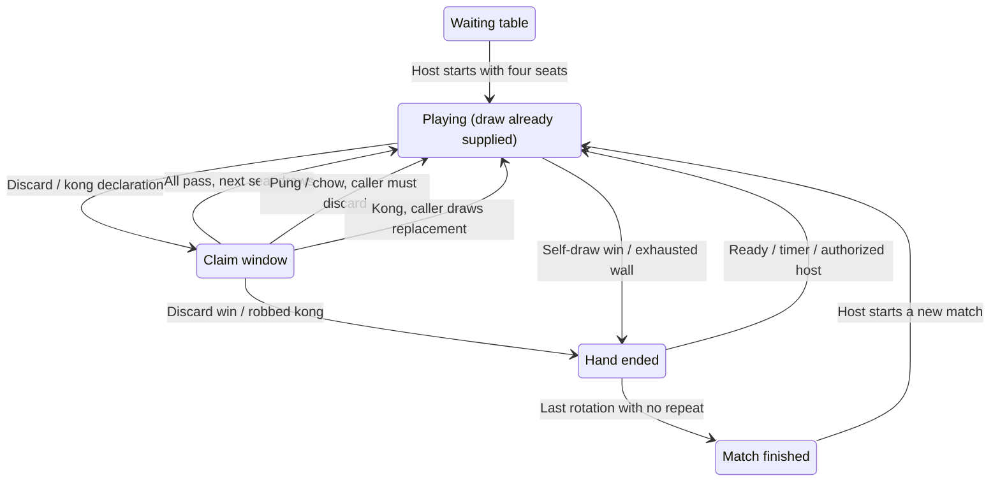

# Test individual game states

Use deterministic scenarios to exercise a rule directly, then use the socket and browser suites
to check that players see the same result. These tests use isolated state; they do not change your
saved rooms. The public app has no debug endpoint for changing hands or wall order.

## Quick commands

```sh
npm ci
npm run test:state                  # Rules, individual transitions, scoring, winning routes
npm run test:state -- -t 'start'     # Just starting and dealing
npm run test:state -- -t 'draw'      # Taking tiles and drawn hands
npm run test:state -- -t 'pung'      # Pung claims and priority
npm run test:state -- -t 'chow'      # Chows, sequence choices, and chow-to-win
npm run test:state -- -t 'kong|kan'  # Open, concealed, added, replacement, and robbing
npm run test:state -- -t 'win'       # Legal wins and settlement
npm run test:state -- -t 'exhaustion|transitions|last rotation'
```

`-t` is a regular expression matched against test names. To run one file or keep rerunning it:

```sh
npx vitest run tests/game-state.test.ts
npx vitest tests/game-state.test.ts
```

The new scenario suite defaults to seed **2048**. Repeat it with a different deterministic seed:

```sh
MAHJONG_TEST_SEED=42 npx vitest run tests/game-state.test.ts
```

Use an integer from 0 through 4294967295. Include the seed and failing test name in bug reports.
The older engine suite also covers 25 seeded deals per preset and complete bot-driven hands.
Production games use cryptographic shuffling; the test seed is never a room setting.

## State transitions



The engine enters `finished` directly when a final hand ends; the diagram separates that condition
for readability. Ordinary drawing is automatic at turn entry. There is no separate client “draw”
command. A pung/chow uses the discard and tiles from the claimant's hand, then requires a discard
without taking another tile. A conventional completed hand must use **Win**, rather than declaring
its final set as a chow/pung. Singapore special set wins are handled separately.

## Coverage map

| Part                 | Assertions                                                                                                                         | Where / targeted command                                              |
| -------------------- | ---------------------------------------------------------------------------------------------------------------------------------- | --------------------------------------------------------------------- |
| Start                | Four seats required, East gets 14 usable tiles, others 13, only East acts, clock correct                                           | `game-state.test.ts` / `-t start`                                     |
| Tile set and dealing | 136/144/148 tiles, four copies per kind, bonus replacements, deterministic shuffle, conservation                                   | `engine.test.ts` / `-t 'seeded tiles'`                                |
| Draw and discard     | One tile leaves the hand, stays in river while claims wait, next seat draws exactly once                                           | `game-state.test.ts` / `-t draw`                                      |
| Pung                 | Exact three physical tiles move to the exposed set, discarder marked claimed, caller discards without drawing                      | `game-state.test.ts` / `-t pung`                                      |
| Chow                 | Following player only, every legal sequence, exact tiles, no extra draw; full chow → discard → later draw → win                    | Both state files / `-t chow`                                          |
| Kong                 | Four-tile set, replacement source, dead-wall refill, extra dora, robbing an added kong                                             | Both state files / `-t 'kong\|kan'`                                   |
| Priority and clicks  | Win beats melds; configured meld ordering; equal priority uses receipt order; deadline and stale clicks rejected                   | `engine.test.ts` / `-t 'claim arbitration'`                           |
| Win                  | Qualifying score, all declared sets retained, payments sum correctly, duplicate win cannot pay twice                               | `game-state.test.ts` / `-t win`                                       |
| Scoring              | MCR fan before flowers; Riichi yaku/han/fu before dora; Singapore animals, flowers and cap; house rules and fake chips             | `engine.test.ts` / `-t 'scoring adapters'`                            |
| Riichi               | Declaration/deposit, locked discards, furiten, passed ron, permitted concealed kan                                                 | `engine.test.ts` / `-t 'Riichi\|riichi\|furiten'`                     |
| Singapore            | Animals, flowers, replacement draws, instant bonuses, special sets, seven-flower theft, reserved final tiles                       | `engine.test.ts` / `-t Singapore`                                     |
| Drawn hand           | Last live draw plays out, exhaustion ends hand; readiness clears old hand state and keeps balances                                 | `game-state.test.ts` / `-t exhaustion`                                |
| Next hand / match    | Configured clock, all-ready setting, no deadlocked configuration, dealer rotation and repeats, final boundary                      | `engine.test.ts` / `-t 'transitions\|last rotation\|seeded complete'` |
| Winning routes       | Qualifying completions use real scoring; no hidden-information dependence or unavailable fifth copies                              | `hand-analysis.test.ts`                                               |
| Privacy              | Only own concealed tiles, public counts/melds, no wall/seed/ura in client view                                                     | `game-state.test.ts` / `-t privacy`                                   |
| Networking           | Four real clients, synchronized turn/readiness, host permissions, stale commands, reconnect, saved restart, bots, origin rejection | `multiplayer.test.ts`                                                 |
| Rack / river         | Local ordering, sort after draw, grouped historical counts                                                                         | `table-ui.test.ts`, desktop/mobile browser suites                     |
| Start presentation   | Shuffle/deal once, sound spread over the sequence, no replay on update/reload, reduced motion, usable touch controls               | `browser/game-start.spec.ts`, `mobile/table.spec.ts`                  |

These are executable regression scenarios, not proof of every possible tile arrangement or every
scoring-pattern interaction. When a new edge case appears, add a small reproduction beside the
relevant rule and keep it after the fix.

## Network and visual checks

```sh
npx vitest run tests/multiplayer.test.ts
npx playwright install chromium webkit
npm run test:e2e
npm run test:mobile

# Watch a specific deterministic table scenario:
npx playwright test tests/browser/table-window.spec.ts --headed -g 'legal claims'
npx playwright test tests/browser/game-start.spec.ts --headed
npm run test:mobile -- --project='iPhone WebKit' --headed

# Interactive test picker, browser timeline, DOM inspection:
npx playwright test --ui
```

Mobile projects use real Chromium/WebKit engines with Android/iPhone touch, viewport and device
settings. They test portrait/landscape containment, tapped tooltips, routes, pinned discards,
complete win display, readiness, auto-sort, and starting the game. They do not replace physical
phone checks for GPU performance, OS audio policy, or unreliable mobile networks.

Playwright builds the client, launches port **3101**, and uses `test-results/browser-state.json`.
Deterministic table scenarios also create real in-memory Socket.IO servers on random local ports.
Run desktop and mobile commands sequentially because they share the build port. Failed cases save
screenshots and traces in `test-results/`; `npx playwright show-trace PATH_TO_TRACE.zip` opens a trace.

Audio tests inspect scheduled Web Audio voices and their timing. For sound quality, enable the
speaker while waiting at a table, then start: hear the dense shuffle chatter, wall click, four-seat
deal packets, and finish chime. Try the volume slider and mute. On a phone, interact with the page
first so the browser can unlock audio. The opening takes about 2.3 seconds and never blocks moves.

See [TESTING.md](../TESTING.md) for four independent identities, LAN phones, and remote friends.

## Add a scenario

1. For a direct rule transition, use `seededGame` or `scenario` from
   [`tests/fixtures/game-state.ts`](../tests/fixtures/game-state.ts). `scenario` allocates unique
   physical tiles from a seeded pool. Shorthand: `123m` = characters, `123p` = dots, `123s` = bamboo,
   `1234567z` = East/South/West/North/Red/Green/White. It fills unspecified tiles automatically.
2. Set only the rule or boundary you need. Use explicit millisecond timestamps (initial time is 1000) instead of sleeping. Use `applyAction` with the current decision ID and an action returned
   by `legalActions`; use `tickGame` for clocks. A fixture can arrange a draw, but the test must run
   the transition through the real engine.
3. Assert phase, turn, decision, hand/meld/discard changes, deadline, and payments as relevant.
   Call `assertTiles` after transfers to verify every physical tile exists exactly once. Claimed
   discards are historical references and are excluded from ownership counting.
4. Add negative checks: wrong seat, repeated/stale action, illegal set, insufficient score, or
   expired window. Compare state before/after a rejected action where it should remain unchanged.
5. Add a socket test for protocol/authorization changes, or a browser fixture for a visible bug.
   Keep all rigged states under `tests/`; never expose a production command that accepts client
   hands, scores, seeds, or replacement tiles.

## Before a release

```sh
npm run format:check
npm test
npm run test:deploy
npm run build
npm run test:e2e
npm run test:mobile
```

Deployment controller tests check command restrictions, health-based recovery, digest recording,
and state-version protection. [DEPLOYMENT.md](../DEPLOYMENT.md) describes a VPS acceptance test,
release publishing, image rollback, and explicit backup restoration.
